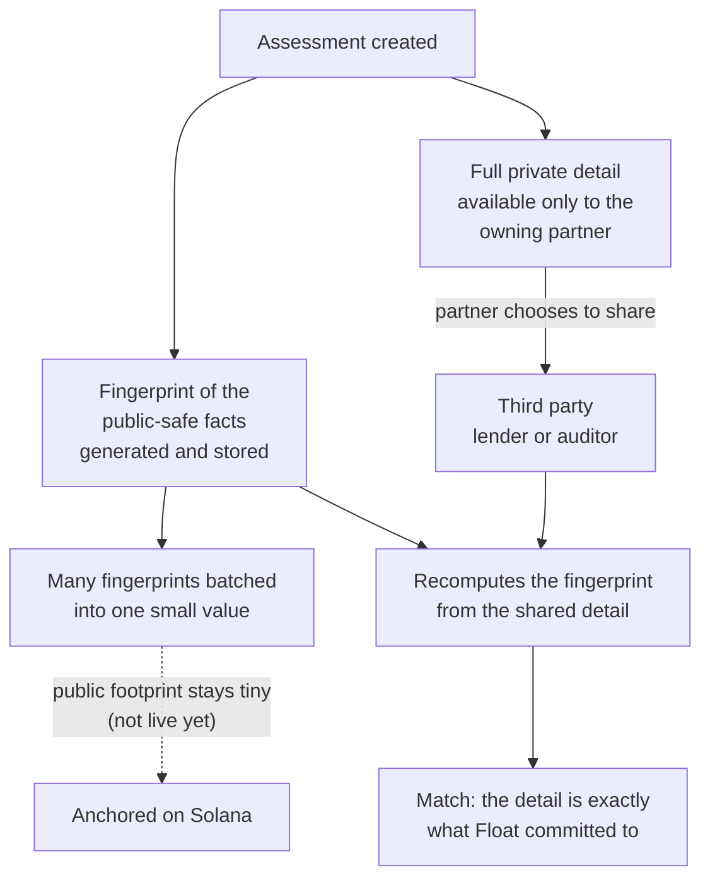
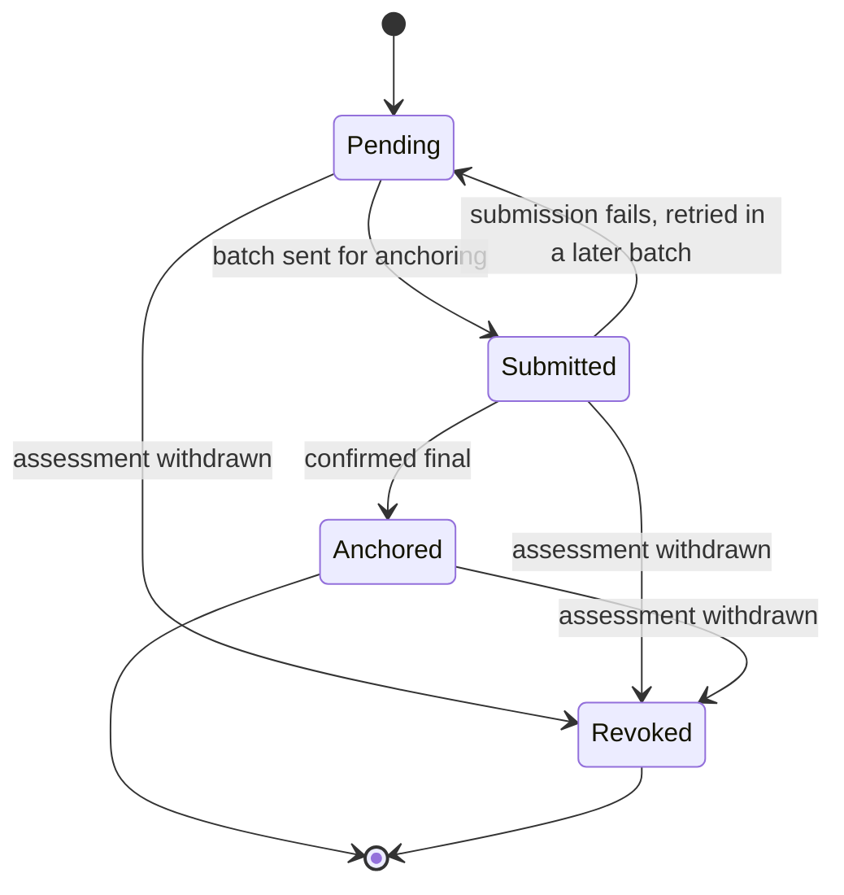

## Design principles

<CardGroup cols={2}>
  <Card title="Non-custodial" icon="fa-solid fa-hand">
    Float never holds, routes or moves funds. Partners control the capital and make every financing decision. Float records and verifies.
  </Card>
  <Card title="Verified evidence only" icon="fa-solid fa-circle-check">
    Portable reputation is built only from outcomes Float verifies itself, never from what a partner reports.
  </Card>
  <Card title="Partner-scoped data" icon="fa-solid fa-lock">
    A partner sees its own data. The one deliberate exception is reputation, which is shared across partners with the business's consent.
  </Card>
  <Card title="Isolated environments" icon="fa-solid fa-flask">
    Test and live are fully separate. Test data never mixes with live data.
  </Card>
</CardGroup>

## Partner-reported state vs Float-verified evidence

The most important rule in Float.

| | Partner-reported state | Float-verified evidence |
|---|---|---|
| **Source** | Reports a partner sends to Float | Float's own on-chain observation |
| **Used for** | The partner's bookkeeping | Portable reputation |
| **Affects reputation?** | ❌ **Never** | ✅ **Yes, the only input** |

<CardGroup cols={3}>
  <Card title="Reports stay reports" icon="fa-solid fa-eye-slash">
    A repayment you report never looks chain-verified.
  </Card>
  <Card title="Defaults are bookkeeping" icon="fa-solid fa-book">
    A default you declare updates your records. It creates no reputation evidence.
  </Card>
  <Card title="Enforced by the data layer" icon="fa-solid fa-database">
    The rule is enforced at the database level, so it holds even if application code is wrong.
  </Card>
</CardGroup>

<Note>
Float-verified evidence only exists where on-chain observation is enabled. Where it is off, repayments are marked as not verifiable and reputation stays empty. See the [Roadmap](/roadmap) for what is enabled today.
</Note>

## Verifiable assessments

Float can prove it issued a specific assessment, the exact outcome and terms, without putting any private business or invoice data anywhere public.

Only a small cryptographic **fingerprint** of the assessment's public-safe facts ever becomes public. The private detail stays with the partner that owns the assessment, who can show it selectively to whoever they choose, such as a lender or an auditor. That party can then check the detail they were shown against the fingerprint, **without taking Float's word for it**.

Fingerprints are batched, and each one gets a **proof** that it belongs to its batch. Only the single value that represents the whole batch is anchored publicly, so the public footprint stays tiny no matter how many assessments Float issues.

### Lifecycle

Every attestation moves through these states.

<Warning>
**Anchoring is not live yet.** Fingerprints, batching, proofs and checking shared detail against a fingerprint already work. The on-chain step is still being built, so every attestation currently stays at **Pending**. Revocation is part of the design but isn't wired up yet either.
</Warning>

<CardGroup cols={2}>
  <Card title="Decision log" icon="fa-solid fa-scale-balanced" href="/decision-log">
    The decisions that matter most, and why.
  </Card>
  <Card title="Roadmap" icon="fa-solid fa-map" href="/roadmap">
    What's real and what's still being built.
  </Card>
</CardGroup>
