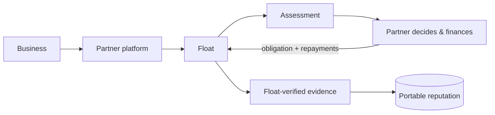

Float is a cross-platform credit infrastructure for service providers on Solana. It does three things:

<CardGroup cols={3}>
  <Card title="Underwrites receivables" icon="fa-solid fa-file-invoice-dollar">
    You submit an invoice or a credit line. Float returns an assessment.
  </Card>
  <Card title="Records obligations" icon="fa-solid fa-receipt">
    After you finance, register the obligation. Repayments come from your reports or Float's chain observation.
  </Card>
  <Card title="Builds reputation" icon="fa-solid fa-shield-halved">
    Portable business reputation, from evidence Float verifies independently.
  </Card>
</CardGroup>

<Warning>
Float is **not** a lender, pool, custodian or payment processor. It never disburses, holds, routes or moves funds. Your platform controls the capital and makes every financing decision.
</Warning>

## Two products, one platform

| | Invoice financing | API/RPC credit lines |
|---|---|---|
| You submit | A receivable | A credit-line request |
| After underwriting | Register an obligation | Open a credit facility with usage and settlements |

Both share the same businesses, consent, underwriting lifecycle and reputation.

## Partner-reported vs Float-verified

<CardGroup cols={2}>
  <Card title="Partner-reported" icon="fa-solid fa-pen-to-square">
    Everything you send about an obligation. Drives **your** bookkeeping. Never affects reputation.
  </Card>
  <Card title="Float-verified" icon="fa-solid fa-circle-check">
    What Float observes itself, on-chain. The **only** input to portable reputation.
  </Card>
</CardGroup>

See [Architecture](/architecture) for the full rule.

## The partner journey

<Steps>
  <Step title="Create or link the business">
    Register the business you serve. If another partner has already verified the same wallet, you're linked to the same business. That is the only way two partners share an identity.
  </Step>
  <Step title="Record consent (optional)">
    Without the business's consent, reputation can't be read.
  </Step>
  <Step title="Submit for underwriting">
    Underwriting is asynchronous. You get an immediate acknowledgement and the result follows.
  </Step>
  <Step title="Answer information requests">
    If more is needed, provide the data or documents requested and the request resumes.
  </Step>
  <Step title="Read the assessment">
    You get a risk band, confidence, verification levels and reason codes. **No** approve/decline and no price. That decision is yours.
  </Step>
  <Step title="Finance, then register the obligation">
    Pay on your own rails, then register the obligation. Float gives you a repayment reference for the payer to include in the repayment transaction.
  </Step>
  <Step title="Report repayments or a default">
    These update **your** bookkeeping. Float verifies on-chain only where chain observation is enabled.
  </Step>
  <Step title="Read portable reputation">
    A summary of Float-verified outcomes. Never amounts, partners or invoices.
  </Step>
</Steps>

## Environments and access

<Warning>
**Float is pre-launch.** Every environment Float runs today is staging, whatever it is called in infrastructure or configuration. Names are not a signal of real-money readiness. Don't treat anything here as production-ready.
</Warning>

Your API key decides the environment, and test and live data never mix.

| | Test keys (`fk_test_…`) | Live keys (`fk_live_…`) |
|---|---|---|
| Underwriting | Sandbox. Mock results, not real assessments | Not available. Requests return `503` |
| KYB | Sandbox. Mock results | Not available. Requests return `503` |
| Chain observation | Solana devnet | Not enabled |
| Document uploads | Not available yet (`503`) | Not available yet (`503`) |

Float never moves funds in either environment. See the [Roadmap](/roadmap) for the full list of what is real, and the [sandbox outcomes](/get-started#sandbox) you can trigger with a test key.

**Getting credentials.** There is no self-serve signup yet. To get partner credentials today, contact the Float team directly.

## Integration at a glance

<AccordionGroup>
  <Accordion title="Authentication and environments">
    Requests are authenticated with a bearer API key. The key's prefix selects the environment.
  </Accordion>
  <Accordion title="Idempotency">
    Send an idempotency key on create requests so retries never duplicate. Replaying a key with the same body returns the original result; reusing it with a different body is rejected.
  </Accordion>
  <Accordion title="Events">
    Partners can poll an ordered event feed or receive signed webhooks carrying the same events.
  </Accordion>
  <Accordion title="Money and IDs">
    Money is an integer in minor units, sent as a string with a currency. IDs are prefixed (`biz_`, `uwr_`, `obl_`) and stable forever.
  </Accordion>
</AccordionGroup>

Exact endpoints are on hold while the API is finalized. See [API Reference](/api-reference).
