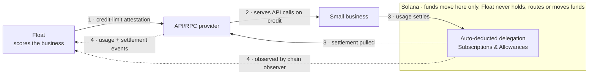
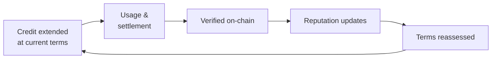
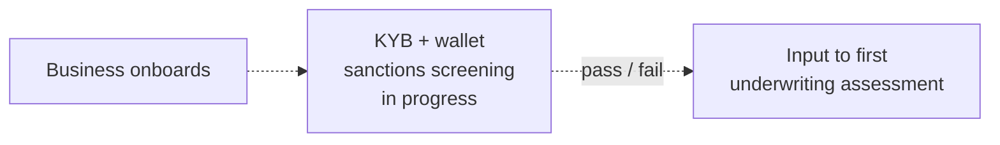
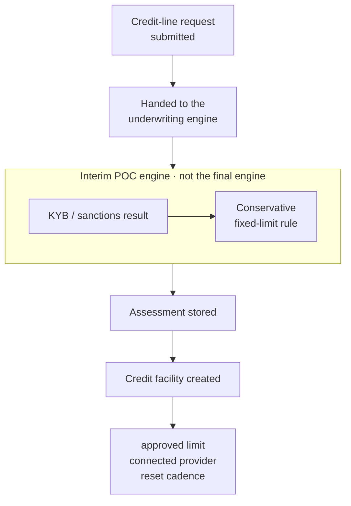

This page describes the proof-of-concept credit-line flow for API/RPC providers. The credit-line mechanics (facilities, usage, limits, settlements, on-chain observation) are built. Underwriting and KYB are interim. Each section says which is which. See the [Roadmap](/roadmap) for the full list.

<CardGroup cols={4}>
  <Card title="Relationship" icon="fa-solid fa-handshake" href="#service-provider-float-small-business">
    Who does what
  </Card>
  <Card title="Tiers" icon="fa-solid fa-stairs" href="#tiers-for-higher-limits">
    How limits grow
  </Card>
  <Card title="KYB" icon="fa-solid fa-id-card" href="#know-your-business-kyb">
    Verifying businesses
  </Card>
  <Card title="Underwriting" icon="fa-solid fa-scale-balanced" href="#underwriting">
    Interim engine
  </Card>
</CardGroup>

## Service provider, Float, small business

The core credit-line relationship. Float scores the business and sends the provider a credit-limit attestation. The provider serves API calls on credit, and the business settles through an auto-deducted Solana delegation. Usage and settlement events flow back to Float and update reputation.

<CardGroup cols={3}>
  <Card title="Float" icon="fa-solid fa-shield-halved">
    Scores, attests and records. Reputation is built from what Float verifies on-chain.
  </Card>
  <Card title="Provider" icon="fa-solid fa-server">
    Holds the capital, serves the calls and reports usage. The limit caps **unsettled usage**.
  </Card>
  <Card title="Business" icon="fa-solid fa-store">
    Uses the API on credit. Settlement is a delegation the business controls on-chain.
  </Card>
</CardGroup>

<Warning>
Float is **not** the lender or the custodian here. The provider extends the credit, and the delegation moves funds directly from the business to the provider. Float observes and attests.
</Warning>

## Tiers for higher limits

Limit and rate move together as a function of settlement history. Each clean cycle earns better terms, but the step gets smaller as the streak lengthens. There is little information early, so the first moves are big. Once there is a track record, the same evidence moves the terms less.

| Stage | Limit | Fee | Step in limit |
|---|---|---|---|
| Starting terms | $1,000 | 3.0% | n/a |
| After one clean cycle | $2,500 | 2.5% | +$1,500 (+150%) |
| After two clean cycles | $3,500 | 2.2% | +$1,000 (+40%) |

<Note>
These numbers are **illustrative**. Today's first version of credit reputation counts only settled periods and failed settlement pulls, observed on-chain. See the [Roadmap](/roadmap) for what the next version still has to decide.
</Note>

## Know-Your-Business (KYB)

The pre-check before a business's first credit line, when no on-chain reputation exists yet. A pass or fail feeds into the first underwriting assessment as one input.

<Warning>
**In progress, not live.** Until the KYB integration is finished, businesses stay unverified. Test keys use a sandbox; live keys return `503`. The dashed lines show the flow that is being built.
</Warning>

## Underwriting

How a credit-line request becomes an assessment, and then a credit facility.

<Steps>
  <Step title="Submit">
    The provider submits a credit-line request. It is acknowledged immediately and processed asynchronously.
  </Step>
  <Step title="Dispatch">
    Float hands the request to the underwriting engine.
  </Step>
  <Step title="Interim assessment">
    The POC engine combines the KYB and sanctions result with a conservative fixed-limit rule. The real engine isn't built yet.
  </Step>
  <Step title="Store and open the facility">
    The assessment is stored, and a credit facility is created with its approved limit, connected provider and reset cadence.
  </Step>
</Steps>

<Note>
This is the **interim** version. Live keys return `503` until an engine is connected, and sandbox results are test-only. The final engine and risk band taxonomy are still open.
</Note>
